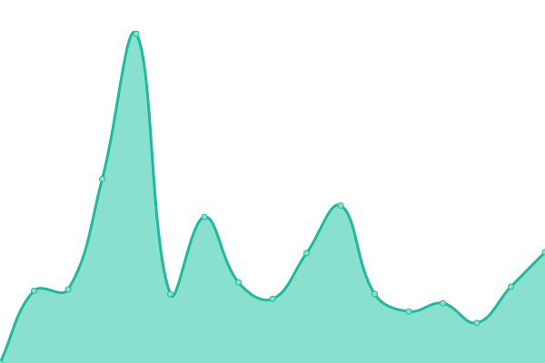
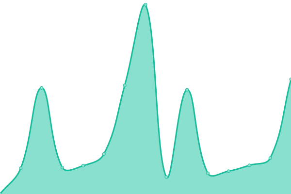
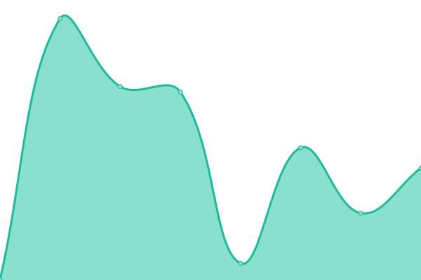

# [📈 Live Status](https://status.nexaorion.tech): <!--live status--> **🟩 All systems operational**

This repository contains the open-source uptime monitor and status page for [Nexaorion Group](https://status.nexaorion.tech), powered by [Upptime](https://github.com/upptime/upptime).

With [Upptime](https://upptime.js.org), you can get your own unlimited and free uptime monitor and status page, powered entirely by a GitHub repository. We use [Issues](https://github.com/Nexaorion/status-page/issues) as incident reports, [Actions](https://github.com/Nexaorion/status-page/actions) as uptime monitors, and [Pages](https://status.nexaorion.tech) for the status page.

<!--start: status pages-->
<!-- This summary is generated by Upptime (https://github.com/upptime/upptime) -->
<!-- Do not edit this manually, your changes will be overwritten -->
<!-- prettier-ignore -->
| URL | Status | History | Response Time | Uptime |
| --- | ------ | ------- | ------------- | ------ |
|  [Auth Gateway](https://auth.nexaorion.cn/demo-app) | 🟩 Up | [auth-gateway.yml](https://github.com/Nexaorion/status-page/commits/HEAD/history/auth-gateway.yml) | 

 3036ms
     
 | 

<a href="https://status.nexaorion.tech/history/auth-gateway">90.28%</a>
    

|  [IAM System](https://sso.nexaorion.tech) | 🟩 Up | [iam-system.yml](https://github.com/Nexaorion/status-page/commits/HEAD/history/iam-system.yml) | 

 5820ms
     
 | 

<a href="https://status.nexaorion.tech/history/iam-system">98.55%</a>
    

|  [Mail Server](https://mail.nexaorion.tech) | 🟩 Up | [mail-server.yml](https://github.com/Nexaorion/status-page/commits/HEAD/history/mail-server.yml) | 

 675ms
     
 | 

<a href="https://status.nexaorion.tech/history/mail-server">99.80%</a>
    

|  [WAF](https://iam-waf.nexaorion.tech) | 🟩 Up | [waf.yml](https://github.com/Nexaorion/status-page/commits/HEAD/history/waf.yml) | 

 2337ms
     
 | 

<a href="https://status.nexaorion.tech/history/waf">99.12%</a>
    

|  [Docs](https://docs.lanko.space) | 🟩 Up | [docs.yml](https://github.com/Nexaorion/status-page/commits/HEAD/history/docs.yml) | 

 315ms
     
 | 

<a href="https://status.nexaorion.tech/history/docs">98.81%</a>
    

<!--end: status pages-->

[**Visit our status website →**](https://status.nexaorion.tech)

## 📄 License

- Powered by: [Upptime](https://github.com/upptime/upptime)
- Code: [MIT](./LICENSE) © [Anand Chowdhary](https://anandchowdhary.com), supported by [Pabio](https://pabio.com)
- Data in the `./history` directory: [Open Database License](https://opendatacommons.org/licenses/odbl/1-0/)
